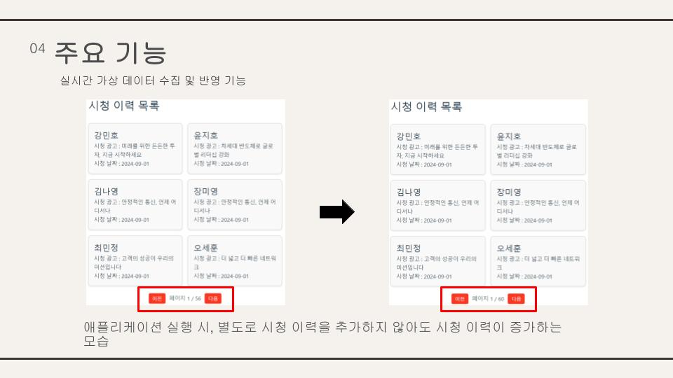

# 교육 과정 1st 프로젝트 :pushpin:
## 개발일정 :triangular_flag_on_post:
<b>2024년 9월 4일 ~ 2024 9월 11일</b>
## :video_game: Genie TV LiveAD+ 관리 서비스

## :soccer: 프로젝트 선정 이유
개인 프로젝트 주제 선정에 앞서, Genie TV LiveAD+ 관리 서비스에 알게 되었고 수업에서 배운 내용을 활용하면 다양한 기능을 테스트 할 수 있을 것 같아서 제작하였다.

## ✅ 서비스 기획

  
상세 정보

  
  
  

## ✅ ERD

  
상세 정보

  
  

## ✅ 데이터

  
상세 정보

  
  
  
  

## ✅ 아키텍처

  
상세 정보

  
  
  
  

## ✅ 주요기능

  
주요 기능

  
  
  
  
  
  
  
  
  
  
  
  
  

## ✅ 프로젝트 회고
짧은 기간이었지만 기존에 다뤄본 적 없는 Spring 과 Vue를 다뤄볼 수 있어서 좋았다.
Spring의 구조와 패턴을 경험해 볼 수 있어서 좋았고 디자인적인 부분은 보완할 필요성을 느꼈다.

